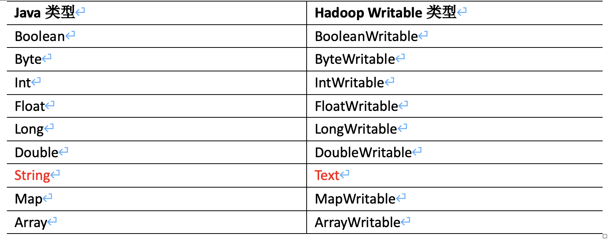

# 课程记录和进度

88p,89p源码自己看一下,job提交和切片源码

课程到99p ,跳到125开始看


# 问题待解决


1  combineInputFormat，可以对多个小文件先先合并之后再执行切片，来生成map任务数量，那么在hive中如何设置为combine呢

3 为什么说mr 为什么不擅长迭代,举出具体例子，是因为mr的模式吗？手写mapper,recuder,代码不擅长迭代，没有数据集类似spark的rdd

——————————————————————

业余问题：

1.hadoop文件写入的时候，如果多个任务同时操作一个表会出现什么？（文档里是一个文件只支持一个线程执行）

2.linux脚本问题，ssh $i  "zkServer.sh  $* "  2> /dev/null  ，如果把2> /dev/null 去掉，ssh执行的时候会打印出启动日志，

问题是如果启动失败，不打印日志不会出问题吗？测试了一下，改其中一个project3 变成4，之后没有错误日志，所以有待改进。

3.对于已经成型的集群，有几千个任务，有的任务迭代很多次已经没人需要了，这种任务应该停止，怎么找到那些相关任务，相关的sql停下来。后续怎么跟进维护这种。 如果相关数据已经没有更新了，那么sql执行的也快。

5 把project3的datanode 进程kill掉之后，9870界面还是显示3个可用，好奇怪

# 问题已解决(待回顾)

### 文件集中同节点

虽然集群副本模式设置为1,不知道为什么上传个800m文件分的7个block都存在一个datanode上

因为当为多个副本时，第一个副本存储位置默认是本机节点，然后再到另一个机架节点，然后再到第二个机架节点其他服务器

### mr必排序原因

错误理解: 有的sql,不需要排序，reduce排序浪费性能。例如count(*) group by

排序操作是对相同reduce的不同key排序，保证同key之间是连续的，是一种优化，知道检测到key变化了，就说明你group by的字段，结束了。因此必须排序

### 进行shuffle的sql任务

orderby , group by , join , 开窗函数  这些，会走完整的mr任务，进行shuffle。

如果只进行select查询，where过滤等查询，只走map，没有reduce任务。


# 问题已理解(记录)

```mysql


### Text放外面没问题
视频的代码的Text是放在mapper任务外面的，这样不是公用一个吗？不会更改吗？
在serilizable代码中的,HashMap已经确认是一个了。
mapper任务把Text传给write(key,text),源码的实现类是复制一个value，而不是把Text直接放队列里,所以不会出问题

private void writeToQueue(KEYOUT key, VALUEOUT value) throws IOException,
    InterruptedException {
  this.keyout = (KEYOUT) ReflectionUtils.newInstance(keyClass, conf);
  this.valueout = (VALUEOUT) ReflectionUtils.newInstance(valueClass, conf);
  ReflectionUtils.copy(conf, key, this.keyout);
  ReflectionUtils.copy(conf, value, this.valueout);


### mr代码序列化报错
序列化serialize里面代码问题找到了，序列化出问题了，user  = dataInput.readUTF();  上面传的dataOutput.writeBytes(user) 
应该用writeUTF
```


# 大数据生态了解

### hadoop论文

gfs 分布式系统文件论文

https://static.googleusercontent.com/media/research.google.com/zh-CN//archive/gfs-sosp2003.pdf

bigtable大表论文(hbase理论基础)

https://arthurchiao.art/blog/google-bigtable-zh/

https://static.googleusercontent.com/media/research.google.com/zh-CN//archive/bigtable-osdi06.pdf


mapreduce论文

https://static.googleusercontent.com/media/research.google.com/zh-CN//archive/mapreduce-osdi04.pdf

### hdfs和amason s3区别

https://blog.csdn.net/zhang9880000/article/details/132522281

为什么s3是低费用存储，他是根据实际用量收费的，

hdfs 如果数据少了也要安装那么多服务器

### 数据湖


# 虚拟机集群

### 虚拟机集群相关

服务器用户:lpc  密码 121995

mysql   root  密码121995

winodows安装的mysql root 121995


环境变量配置在：/etc/profile.d/myenv

自定义脚本在 /usr/bin/里面，查找以前的脚本是 ll /usr/bin | grep lpc


unify   多节点统一执行指令

hpsh 分发修改目录或文件到各节点

hish 启动或者停止metastore和hiveserver2服务 ，用start或者stop 参数控制，status可以看metastore和hiveserver2服务的运行状态


### 集群目录用途

hbase  用来存放hbase相关数据

tmp     临时数据

user    里面的hive/warehouse  是默认hive建库的路径,在hive-site.xml中配置

spark_need: 放spark相关文件目录

​		spark-histroy 是hive用spark引擎时，放运行日志的目录在hive/conf/spark-defults.conf配置的

​		spark-jars  是hive用spark引擎时，告诉hive spark相关的jar包在哪在hive-site.xml配置的

flink_need:flink相关目录

​		flink-jars-with-plugins  放置的是flink相关jar包，不用每次都上传，节点直接就能下载

​		checkpoint_idr  flink的checkpoint

offline_warehouse:离线数仓	

​		flink_warehouse_db : 放置sqoop同步的源数据

​		warehouse   ：是对接hive的database

​		


### spark包多份

spark-local和yarn配置文件都不同，不过都是只有一个，在project1里

spark模式是集群，所以安装3份


# linux方面

--help   对于不懂的脚本指令,百度的版本不同，一般直接在linux --help能看到指令，

比如hadoop --help可以查到fs等指令，然后hadoop fs --help 可以看到fs之后可以接哪些指令

free -h 查看内存剩余情况


### 日志相关

tail -n 10  a.txt  查看文件最后几行

tail -f a.txt 持续查看文件末尾，直到推出

脚本执行的打印结果输出到指定文件： java  a.class  >>a.log


### 运行任务相关

ps -ef|grep kafka |grep -v grep|awk '{print $2} '|xargs kill -9

grep -v grep过滤掉自己

awk '{print $2} ' 获取第二条列据(即即进程号)

xargs kill -9 作为参数传给kill -9


后台运行任务

nohup  任务  & >>a.log

`>` 是把输出转向到指定的文件。注意：如文件已存在的话会重新写入，文件原内容不会保留。
`>>` 是把输出附加到文件的后面，文件原内容会保留下来。


# hadoop版本新特性

Hadoop是一个开源的分布式计算框架，用于处理大规模数据集的分布式存储和处理。下面是Hadoop的一些重要版本及其主要特性的概述：

1. Hadoop 1.x系列：这是Hadoop的初始版本，包括HDFS（Hadoop分布式文件系统）和MapReduce计算模型。它提供了基本的分布式存储和处理功能。

2. Hadoop 2.x系列：这是Hadoop的重要升级版本，引入了YARN（Yet Another Resource Negotiator）作为资源管理器，取代了旧版中的MapReduce作业调度器。YARN使得Hadoop可以运行更多类型的计算模型，如Spark、Hive等。此外，Hadoop 2.x还引入了高可用性的HDFS（HA HDFS）和其他改进。

3. Hadoop 3.x系列：这是Hadoop的又一重要升级版本，带来了一些关键的改进和新特性。其中一些重要的特性包括：
   - HDFS Erasure Coding：引入了纠删码编码，以减少存储开销并提高数据冗余容错性。
   - YARN容器复用：允许在同一节点上复用容器，提高资源利用率和作业启动速度。
   - GPU支持：增加了对GPU加速计算的支持，提供了更高的计算性能。
   - 周期性容器调度：允许周期性任务的调度，如定期作业和服务。
   - HDFS存储带宽：提供了更好的数据传输性能和带宽控制。
   - 各种性能和稳定性改进：包括更好的内存管理、调度器改进、容错机制等。

这些是Hadoop版本中的一些重大意义的新特性，但具体升级与否需要根据您的具体需求和现有环境来决定。如果您的企业正在使用较旧版本的Hadoop，升级到较新的版本可能会带来更好的性能、稳定性和功能扩展。然而，升级也可能需要进行一些工作，如配置更改、应用程序兼容性测试等。因此，在决定是否升级之前，建议您进行充分的评估和测试，以确保升级对您的业务有实际的益处。

```sql
#容错机制更新
2.x是根据副本容错
3.x是根据纠删码来保存，减少副本占用空间,并且减少了block数量，减少对namenode的内存压力。纠删码大概是原来的0.5副本开销
```


# pom依赖

```xml
        <dependency>
            <groupId>org.apache.hadoop</groupId>
            <artifactId>hadoop-client</artifactId>
            <version>3.1.3</version>
        </dependency>

        <dependency>
            <groupId>org.apache.hadoop</groupId>
            <artifactId>hadoop-hdfs</artifactId>
            <version>3.1.3</version>
            <scope>test</scope>
        </dependency>
    </dependencies>
```


# Hadoop客户端

### 组件官网下载

在官网下载的时候，如果是src.tar ，有src的都是源码，需要编译的。

一般都是下载bin，二进制已经编译好的


集群分配

project1 是namenode管理  有namenode

project2 是yarn管理  有resourcemanager

project3是2nn管理  有seceond namenode

3个服务器同时存数据，且执行任务 所以都有nodemanager和datanode


### hadoop指令

```
hadoop fs -moveFromLocal  /local/a.txt  /hdfs/a.txt  --从本地剪切过去
hadoop fs -copyFromLocal  /local/a.txt  /hdfs/a.txt  --从本地复制过去
hadoop fs -put  /local/a.txt  /hdfs/a.txt  --从本地复制过去等同于copyFromLocal
hadoop fs -appendToFile   /local/a.txt  /hdfs/a.txt  --把本地文件追加到hdfs指定文件末尾

hadoop fs -copyToLocal    /hdfs/a.txt   /local/a.txt  --从hdfs下载到本地
hadoop fs -get    /hdfs/a.txt   /local/a.txt  --从hdfs下载到本地,等同于-copyToLocal 
hadoop fs -getmerge    /hdfs/*   /local/a.txt  --从hdfs合并下载多个文件

```


### hadoop启动

群体启动hadoop    1.namenode 节点  sbin下的start-dfs.sh   2.在resourcemanager节点启动 start-yarn.sh

群体停止hadoop    1.namenode 节点 stop-dfs.sh  2. resourcemanager节点下stop-yarn.sh 

启动历史服务器  在project1  bin/mapred --daemon start historyserver  关闭是stop


单点启动关闭节点  hdfs --deamon start/stop  namenode/datanode/secondarynamenod

​                         yarn --deamon start/stop  namenode/datanode/secondarynamenod


### hadoop常用端口

9870 是hdfs中namenode 查看界面 project1:9870

8088 是hdfs中yarn   查看界面 proeject2:8088

19888是历史服务器   project2:19888 

8020是hdfs内部通信端口，想访问hdfs的文件要通过8020端口,api中都是通过8020来获取hdfs文件

10020是历史服务器内部通信端口


### config文件配置

/etc/hadoop/hdfs-site.xml :配置副本数量，配置namenode的访问端口(默认是9870)

/etc/hadoop/core-site.xml ：配置namenode节点，配置hdfs数据存储目录

/etc/

/etc


### hadoop启动异常问题

如果jps查看进程发现没有，重启集群小时进程已经开启,将linux /tmp下 存在启动进程的临时文件删除


# hdfs

### hdfs设计只支持追加

```mysql
Hadoop的HDFS（Hadoop Distributed File System）是为了适应大规模数据集的存储和处理而设计的。HDFS的设计有以下几个关键特性：

1. **容错性**：通过数据的多副本存储，即使部分硬件故障，也能保证数据的可用性和完整性。
2. **高吞吐量**：系统优化以支持大数据集的高速读写操作。
3. **大文件优化**：HDFS被设计来存储非常大的文件，它支持的单个文件大小远远超过传统文件系统。
4. **流式数据访问**：HDFS是为批处理而设计的，支持一次写入、多次读取的模式。

HDFS的设计原则是“一次写入，多次读取”，这意味着一旦文件被创建和写入，就不能被修改，只能被追加和读取。这样的设计有几个目的：

- **简化系统设计**：避免了文件被频繁修改带来的复杂性，如需要处理文件锁定、版本控制和并发修改等问题。
- **优化写性能**：文件不可修改意味着写操作可以高效进行，因为系统不需要寻找文件中的特定位置进行数据插入或修改，只需将新数据追加到文件末尾。
- **提高数据吞吐量**：HDFS的块结构设计使得可以在多个节点上并行写入和读取数据，从而提高了数据的处理速度。
- **增强数据一致性**：不允许修改可以避免数据在多个副本之间的不一致性。
- **减少元数据操作**：由于不需要频繁更新文件的元数据（如文件大小、修改时间等），减少了对NameNode的负担，提高了系统稳定性。

然而，不支持文件修改和删除确实带来了一些限制，特别是在需要对存储在HDFS上的数据进行频繁更新的应用场景中。这就是为什么出现了如Apache Hudi和Apache Iceberg这样的框架，它们在HDFS之上提供了额外的数据管理功能：

- **Apache Hudi**：提供了能够处理大规模数据集的近实时插入、更新和删除的能力。它提供了更复杂的数据索引、事务控制和回滚功能。
- **Apache Iceberg**：是一个开源的表格式，用于改善大数据的存储、处理和分析。它提供了可扩展的表结构、隐藏的分区、原子性操作等特性。

通过这些框架，用户可以在不牺牲原有HDFS优势的情况下，实现对数据的更新和删除操作，使得HDFS可以更好地适应更广泛的数据管理需求。
```


### hdfs组成作用

namenode : 存储文件元数据，文件名,目录结构，文件属性(生成时间,副本数,文件权限),块所在的datanode信息，处理读写请求

datanode: 存储block块文件,执行读写请求。

secondnamenode(企业中不用):   辅助namenode,定期合并edits,,fsimage,发送个namenode。企业里配置2个namenode，

​     	用来nn的高HA.

client(即hadoop指令): 上传文件时，client将文件切分，与nn交互获取文件位置信息,与dn交互读或写数据,通过一些指令操作hdfs增删改


### datanode存储数据

路径是:hadoop/data/dfs/data/current/BP-780922422-192.168.1.106-1600435629894/current/finalized/subdir0/

目前集群的配置是1个副本，没有多个副本


自己project1产了一个400m的文件,通过hdfs指令上传之后，3个block都在一个project1，应该是拓扑就近的原因。

在window生产一个800m文件，通过9870界面上传，不知道为什么都是存在一个节点的namenode,而不是多节点。


在/hadoop/data 中有datanode的版本号，每次初始化集群时，会生成一个namenode和datanode唯一绑定的版本号，如果这个服务器放到更改配置文件到别的集群，也启动不起来，需要删除data里面数据


### hdfs问题优化


# yarn

### yarn查看日志

提交了个flink 3并行度的任务，代码中有打印操作，怎么找到各节点打印数据。

打开project2:8088 => Applictions找到对应job点进去 => 找到第一列的AttemptID点进去 

=> 看到4个任务(jobmanager,3taskmanager) => 最后一列Logs选一个进去 => 找到taskmanager.log 里面有打印数据


### yarn配置参数

```sql
#yarn.nodemanger.resource.memory-mb
这个是nodemanger最多能给container使用的内存，woker服务器节点是128G,给kafka 10-15g,给datanode 5G,还有zk,hbase等。
设置64G就行

#yarn.nodemanager.resource.cpu-vcores
设置nodemanger可使用的虚拟cpu核数。虚拟cpu数意思，你可以比物理核数多，这样会给yarn更多的cpu抢占资源
服务器是32核，那么不应全给nodemanager，你还有其他线程，如果全给yarn,那么导致其他线程被yarn争抢导致其他线程效率低。
设置为16核。一般都是内存和核数是4:1的关系

#cpu-vcores案例
如果我yarn只设置1cpu可用核数，我同时提交8个yarn任务。
即使你只配置了 1 个虚拟 CPU 核心，YARN 通常也会启动多个 Container。这是因为 YARN 中的 CPU 资源是可以被超额订阅的（over-subscribed），它们都试图在同一时刻运行增强cpu使用

```


### container申请大小

```mysql
在Hadoop中，YARN（Yet Another Resource Negotiator）是负责集群资源管理和作业调度的组件。当Hive执行一个MapReduce作业时，它会通过YARN来申请资源。YARN会根据多个参数来决定为每个Map任务分配多少资源，包括内存和CPU核心数。这些参数可以在YARN的配置文件中设置，如`yarn-site.xml`。

具体到Map任务的内存分配，以下是一些关键的参数：

1. **`mapreduce.map.memory.mb`**: 这个参数用于设置每个Map任务的内存大小。如果没有特别的设置，Map任务会使用这个默认值。

2. **`yarn.scheduler.minimum-allocation-mb`**: 这是YARN中设置的每个容器可以申请的最小内存量。

3. **`yarn.scheduler.maximum-allocation-mb`**: 这是YARN中设置的每个容器可以申请的最大内存量。

4. **`mapreduce.map.java.opts`**: 这个参数用于控制Map任务JVM的堆大小（通过Java的-Xmx和-Xms参数）。通常这个值会小于`mapreduce.map.memory.mb`，因为`mapreduce.map.memory.mb`包括了JVM堆外内存的使用。

当Hive执行MapReduce任务时，它会基于这些参数和作业的具体需求来请求资源。如果Hive表中的文件块大小为128MB，并不直接决定Map任务的内存分配。Map任务的内存分配主要取决于上面提到的参数设置。

假设`mapreduce.map.memory.mb`被设置为1GB，而YARN的`yarn.scheduler.maximum-allocation-mb`被设置为10GB，那么即使单个Hive表的文件块只有128MB，每个Map任务也会请求1GB的内存，前提是没有其他任务级别的特定配置。

在实际操作中，可能需要根据作业的需求和集群的资源情况来调整这些参数。如果Map任务处理的数据量很小，并且不需要很多内存，那么可以适当减小`mapreduce.map.memory.mb`的值，以节省资源并提高集群的利用率。反之，如果Map任务处理的数据量很大或者需要执行复杂的操作，可能需要增加内存分配以避免内存溢出错误。

最后，实际申请的资源量也可能受到YARN资源请求和调度机制的影响，例如，如果集群的资源紧张，YARN可能无法立即满足申请的资源量，这时候任务可能会等待，或者以较小的资源配置启动。
```


### container申请

```sql
在Hadoop中，MapReduce作业执行时，YARN（Yet Another Resource Negotiator）负责管理和调度资源。具体到MapReduce作业，每个map任务通常会在一个YARN container中运行。Container是YARN中资源分配的基本单位，它封装了某个节点上的资源量，包括内存、CPU等。

对于您的问题，有几个因素会影响到会申请多少个container，以及每个container多大内存：

1. **Map任务数量**：在您的例子中，有400个map任务，因为您的100GB表按照每256MB分割成了400个block。

2. **Container内存大小**：这通常由`mapreduce.map.memory.mb`属性决定，该属性指定了每个map任务运行时可以使用的最大内存量。如果这个值没有被设置，它会使用YARN的`yarn.app.mapreduce.am.resource.mb`或者`yarn.app.mapreduce.am.command-opts`中的默认值。

3. **YARN内存配置**：您提到的`yarn.scheduler.maximum-allocation-mb`是YARN可以分配给单个container的最大内存量，这个值设置为16GB。但是，这并不意味着每个container都会被分配16GB。实际分配的内存大小取决于`mapreduce.map.memory.mb`的设置。

4. **资源可用性**：即使您设定了较大的内存大小，实际分配也会受到集群当前资源使用情况的限制。如果集群资源紧张，可能无法为每个map任务分配一个container，这时就会发生排队等待。

5. **并行度**：`mapreduce.job.running.map.limit`可以限制同时运行的map任务数量，这也会影响到实际分配的container数量。

6. **其他作业**：如果集群中还有其他作业在运行，那么可用的资源会更少，这也会影响到您作业的资源分配。

综上所述，实际申请的container数量取决于您的MapReduce作业配置和集群的当前资源状况。如果没有设置特定的内存大小，那么每个container将会使用默认值或者根据资源可用性来确定。如果设置了特定的内存大小，那么每个container将会尝试使用这个值，但是不会超过`yarn.scheduler.maximum-allocation-mb`指定的上限。

为了获取准确的信息，您需要查看您的MapReduce作业的配置，以及集群的资源管理界面（通常是ResourceManager的Web UI）来确定实际的资源分配情况。
```


### yarn组成作用

resource manager:管理整个集群的内存和cpu，统计整个集群还有多少集群和多少个核

node manager：管理单个任务的内存和cpu数

application master :单个任务运行的管理者

container:容器，相当于单独的服务器，封装了运行的资源:内存，cpu，磁盘,网络等,是个虚拟化技术 类似阿里云服务器虚拟化服务器技术。同一时间一个服务器能同时运行几个container 和cpu数和内存有关，4个cpu最多能执行4个。一个container最少是1-8g内存也和总内存有关系


mr任务会启动3个进程：

​	   appmaster：负责整个任务

​		maptask：负责map数据处理

​		reducetask：负责reduce任务

所以合理设置map任务数，可以合理运用内存资源，一个map一个container至少1g内存，如果map数量是100,那么至少要100g内存


### mrApi

java对应 haddop Writable类型

String是Text ,其他的加上Writeable




map方法 每读一行调用一次,是一行行读取文件内容，key传递的是行开始的下标,value传的是行的内容

注意map方法KeyIn类型必须是LongWriteable,ValueIn 必须是Text，因为用的IntWriteabl导致map方法没被调用

map方法：map(KEYIN key, VALUEIN value,Context context) 

​					context.write() 传入k,value 。为什么必须设计传2个参数，因为reduce方法会把相同key对应的数据放

​					入一个迭代器中，所以必须传一个value 				

因为map方法切文件时调用的是默认的TextInputFormat,实现的范型是<LongWritable, Text> 所以,范型必须是Long和Text

```java
public class TextInputFormat extends FileInputFormat<LongWritable, Text> {}
```


reduce方法,reduce任务会把相同key对应的数据放入到一个迭代器中,reduce方法是每有一个key调用一次


driver的main方法用idea执行时，如果系统配置环境变量了，那么环境变量必须正确。如果系统没配置环境变量，也能执行。不清楚什么机制


partioner分区器，来确定哪些数据进去哪个reduce分区


hadoop序列化

java自带序列化太重了，校验数据太多。传输慢

实现序列化

```java
具体实现bean对象序列化步骤如下7步。
（1）必须实现Writable接口
（2）反序列化时，需要反射调用空参构造函数，所以必须有空参构造
public FlowBean() {
	super();
}
（3）重写序列化方法
@Override
public void write(DataOutput out) throws IOException {
	out.writeLong(upFlow);
	out.writeLong(downFlow);
	out.writeLong(sumFlow);
}
（4）重写反序列化方法
@Override
public void readFields(DataInput in) throws IOException {
	upFlow = in.readLong();
	downFlow = in.readLong();
	sumFlow = in.readLong();
}
```

（5）注意反序列化的顺序和序列化的顺序完全一致 即字段顺序必须一样
（6）要想把结果显示在文件中，需要重写toString()，可用”\t”分开，方便后续用。
（7）如果需要将自定义的bean放在key中传输，则还需要实现Comparable接口，因为MapReduce框中的Shuffle过程要求对key必须能排序。

### map切片规则

数据切片，当mr任务对应的是一个目录的wordcount，一个文件至少是一个map任务，如果文件大小大于128M,还要再切片，启动多个map任务，设置为和hdfs存储块相同，应该是为了mr的时候，正好一个块对应一个map，不用切了。

在Driver中用的就是FileInputFormat配置的，在FileInputFormat点击getSplits()方法可以看切片方式

根据inputFormat规则不同，切法不同。FileInputFormat是父类，NLine,Text,CombineFile 是实现类

默认的是TextInputFormat这个是实现类没有重写getSplits方法,combine实现类重写getSplits方法了


File，NLine和Text是按文件切片，一个小文件至少一个片，大文件再按128m

combine当都是小文件时，会逻辑合并小文件，将合并后的小文件按128M 切

当某个文件被压缩，切该压缩不支持切分时，则无法切片只有一个map任务


### mr工作流程

优点:高容错:一个机器挂掉，任务回转移到其他节点

缺点:(为什么) 不擅长迭代式计算, 任务1的结果作为任务2的输入，任务2的结果作为任务3的输入


1  读取文件,根据文件数量和大小，划分片job.split，生成执行任务jar包，相关配置文件配置job.xml提交给RM

2  启动根据提交的信息启动对应数量的maptask任务

3 maptask具体任务，根据inputformat的类型， 比如TextInputFormat ，读取一行后传递偏移量和数据给mapper

4 mapper输出的kv对，输出给outputCollector(内存环型缓冲区)，默认大小100M ,当80%的时候反向溢写磁盘

因为一个切片默认最大是128,所以设置100内存区，基本几次就可以把切片数据溢写完毕。

 缓冲区记录的了该kv数据，以及kv应该分配给哪个reducer，不同reducer的数据，不同分区的信息。当溢写时，会对数据进行排序，

这里的排序是对同1分区的不同key排序，保证相同key是连续的。

当所有溢写结束，然后对同分区的多个溢写文件再进行merge归并排序。 当归并之后可以选择是否压缩，然后写入磁盘，等reduce来

拉取。

5  开reduce task，reduce主动从map任务拉取分区数据，将多个map任务的分区数据再进行一次归并排序，这样得到的就是相同key是连续的数据，然后进行分组。


### mr压缩


### MR优化

1.合理运用inputFormat选择，比如100个小文件的目录，如果不用CombinInput,1个文件启动一个map任务，每个map任务会有一个container至少1个g的内存。


# 后期规划（集群设置）

1.设置自动添加mysql数据的job，并且设置一个任务监视java程序

2.配置集群监听

3.定期合并小文件脚本

# 面试精简

  版本更新 3.0的hadoop  关于mr资源调度 由独立的yarn来控制，2.0是统一由nn,datanode管理

#### hdfs读写流程

写流程： 

客户端提交个文件，一个分布式文件系统对象 和namenode通信 =>向nn请求上传文件/切块 =>nn检查是否有权限以及目录是否正确等

=>存储节点的选择优先本地节点(也根据该节点的负载能力，因为客户端基本都是一个服务器，就近节点都是那1个) ，近的节点负载多，在根据机架选择第二近的节点。

=》返回给客户端创建传输流=〉传递方式客户端传给一个dn，然后副本是由dn再传给别的dn，减少客户端完成时间。

dn传给下一个dn是内存一边写一遍发下一个dn  =》当第一个块传送完毕之后，才开始第二个块传送

传输方式是64k一个packet，每接收成功一个packet会有个应答


服务器机架：一个可以联网的东西，可以放置多台服务器，内部服务器可以通过机架互相传递数据，也可以通过机架连互联网


副本存储选择：1副本存在本地节点(就近速度),  2副本是另一个机架的一个节点(保证数据可靠性)， 3副本选择第二个机架的另一个节点(

为了提高传速度，同机架传的快)，所以副本传递采用的1dn传2dn再传3dn，是根据副本存储选择来的。

这个副本选择逻辑是原码写的，2下shift查找BlockPlacementPolicyDefault类，查找chooseTargetInOrder方法

```java
  protected Node chooseTargetInOrder(){
    final int numOfResults = results.size();
    //numOfResults == 0 第一个副本
    if (numOfResults == 0) {
      //调用方法是chooseLocalStorage 选择本地
      DatanodeStorageInfo storageInfo = chooseLocalStorage(writer,
          excludedNodes, blocksize, maxNodesPerRack, results, avoidStaleNodes,
          storageTypes, true);
      }
    }
    //dn0是获取第一个节点的机架
    final DatanodeDescriptor dn0 = results.get(0).getDatanodeDescriptor();
    //numOfResults <= 1 第二个副本
    if (numOfResults <= 1) {
      //chooseRemoteRack选择远程的机器子,传入的dno是第一个节点机架
      chooseRemoteRack(1, dn0, excludedNodes, blocksize, maxNodesPerRack,
          results, avoidStaleNodes, storageTypes);
    }
    //第三个副本
    if (numOfResults <= 2) {
      //获取第二节点机器架
      final DatanodeDescriptor dn1 = results.get(1).getDatanodeDescriptor();
      //这步clusterMap.isOnSameRack(dn0, dn1)是判断dn0和dn1如果相等说明该公司服务器只有一个机架
      //如果dn0和dn1不同，else里用的是 chooseLocalRack(dn1） 找和dn1想动机架的节点
      if (clusterMap.isOnSameRack(dn0, dn1)) {
        chooseRemoteRack(1, dn0, excludedNodes, blocksize, maxNodesPerRack,
            results, avoidStaleNodes, storageTypes);
      } else if (newBlock){
        chooseLocalRack(dn1, excludedNodes, blocksize, maxNodesPerRack,
            results, avoidStaleNodes, storageTypes);
      } else {
        chooseLocalRack(writer, excludedNodes, blocksize, maxNodesPerRack,
            results, avoidStaleNodes, storageTypes);
      }
  }
```

读流程

​		客户端创建一个分布式文件系统对象 和namenode通信,请求下载文件 =》nn判断是有权限文件是有否等，返回文件所在的节点

​		=〉客户端创建流，从最近的节点读取数据(也根据该节点的负载能力，因为客户端基本都是一个服务器，就近节点都是那1个)，负载太多，也会换别的节点。先读第一块，完成后再读第二个，不是并行


#### 2nn与nn关系

具体看word

#### dn 工作机制

具体看word


