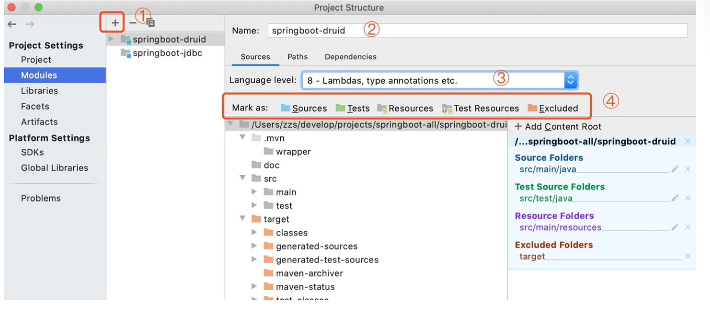
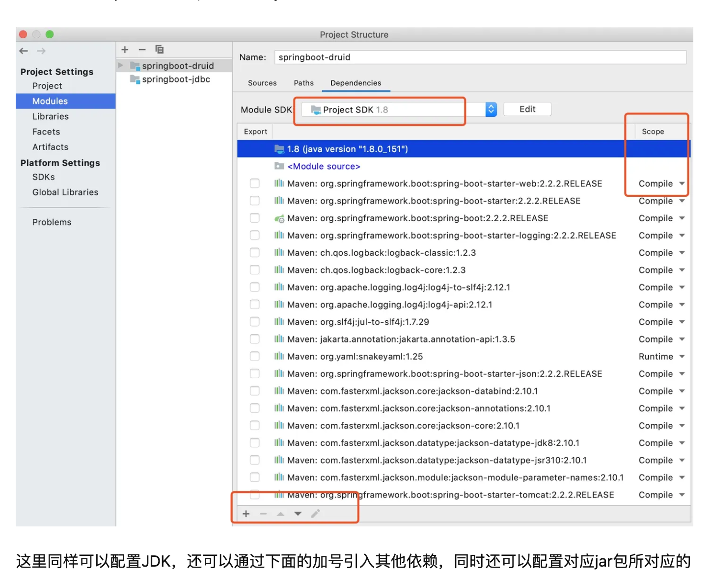

# 问题待解决

#### lombok一直编译失败

java: 程序包lombok不存在.

flink-1.17用不了，新建的就能用lombok不知道怎么回事

# 问题已解决(待回顾)

#### 编译时找不到主类
因为.class文件必须要和java文件在一个项目下，才能读取到。所以.class编译目录必须和项目目录相同
project stucture => project 把output目录 更改为项目全路径\out =>moudle模块 选择inherit project 会自动读取项目路径


#### 无法运行:Commline is too long

edit configuration => 在 include provided下面2行=》shorten command line 选 classpath file就行 


# 问题已记住(备份)


```sql
#### 如何修改源码
idea可以下载source的jar包，能看到源码注释,不过是临时解析的,不能修改，因为是个jar包格式。
想修改源码做注释,要从官网或者github上下载源码,比如之前的hive源码包，还有github上的源码。下载到本地，才能修改。

####手动导入jar包不生效
学习源码的时候，project structure   =>library添加库的时候把source源码包添加进去了，不生效
因为source包是java文件，导入的必须是.class字节码文件,idea才能加载到类

#### idea设置了global不生效
将guava为global，并且也导入项目了，不过代码里还是找不到类别。
因为导入的guava包选的是source.jar选错了这里没有.class文件。source.jar一般比.class要小

#### 编译器error
Compilation failed: internal java compiler error，一般都是github导入项目，导致的需要自己更改
settings=>complier=>java complier版本和project structure不同

#### debug找到断点上一行
当我们打一个断点时,快进到断点，左侧然后有一个方法调用情况，鼠标自己往下找
```


# idea快捷键 

#### 实现类|接口

重写构造器 ，getter，setter等  control+enter     mac版command+ N |   (windows)alt + insert 

实现接口中方法 control + i

重写非必须方法 control + o


#### 编码

创建对象  类.new + tab +.var +tab

生成变量名和对应类型  .var 然后摁tab键 

导包 option+enter

异常捕获上抛 option +shift + 回车

for循环   fori +tab 或者 集合.for +tab

快捷生成if    a1==a2 .if + tab

else-if +tab自动生成(){}

注释  command +/单行注释 	command+option+/ 多行注释

文档注释  /** + 会车

删除一行  command+后退 

新建一行并到行头 shift+ enter

选中代码整体前移  shift + TAB

代码字母大小写切换  command + shift  + u


#### 查看代码

查看某类所在jar包   鼠标放置在类名上等一会，看最后一行

双击shift 搜索

查看类中所有属性和方法  command +F12

查找方法对应代码   command+鼠标左键

查看接口的实现类 control+H ,鼠标选中接口

查找类中的方法 command+F12，然后输入方法名字

返回查看方法进入的位置 command+option+左箭头,右箭头是再回去  windows是control+alt+左箭头

查看某个方法/变量被哪些地方引用     option+F7    windows是alt+F7  或者右键flind useage


# idea效率插件

```sql
#Rainbow Brackets
将括号按照不同颜色进行高亮显示，提高代码可读性和配对括号的识别。
#Key Promoter X
在你使用鼠标执行某个操作时，显示相应的快捷键提示，帮助你学习和使用快捷键，会记录你的鼠标操作，
"Lombok"：
简化 Java 代码的编写，自动生成样板代码，减少冗余的 getter/setter 方法提示哪些可以用快捷键。还会有记录频次
"SonarLint"：
集成 SonarLint 静态代码分析工具，帮助你发现和修复代码质量问题。
"Markdown Navigator"：
idea默认已经下载了，提供对 Markdown 文件的支持，包括实时预览、语法高亮、表格编辑等功能。
```


#### SonarLint

使用方法, 右键项目目录/java文件=> analyze =>选择sonarlint

SonarLint 是一款集成在 IntelliJ IDEA 中的静态代码分析工具，它可以帮助你发现和修复代码质量问题。SonarLint 插件可以分析你的代码并提供实时反馈，帮助你遵循最佳的编码实践和规范。

使用 SonarLint 插件的步骤如下：

1. 下载和安装插件：在 IntelliJ IDEA 中，打开插件市场（Marketplace），搜索 "SonarLint" 并安装该插件。安装完成后，重启 IntelliJ IDEA。
2. 连接到 SonarQube 或 SonarCloud（可选）：如果你的团队使用 SonarQube 或 SonarCloud 进行代码质量管理，你可以连接到这些服务器以获取更全面的分析结果。在 IntelliJ IDEA 的设置中，找到 SonarLint 部分，配置服务器的连接信息。
3. 配置项目绑定（可选）：如果你的项目已经在 SonarQube 或 SonarCloud 上进行了配置，你可以将项目与服务器上的规则进行绑定，以确保 SonarLint 在分析代码时使用正确的规则集。在项目设置中，找到 SonarLint 部分，选择适当的绑定配置。
4. 运行 SonarLint 分析：在 IntelliJ IDEA 中打开你的项目，并确保 SonarLint 插件已启用。当你编辑代码时，SonarLint 会自动分析你的代码，并在编辑器中显示问题和建议。你可以通过点击问题来查看详细信息，并根据建议进行代码改进。
5. 查看 SonarLint 报告：你还可以查看整个项目的 SonarLint 报告，以获取关于代码质量和问题的总览。在 IntelliJ IDEA 的底部工具栏中，找到 SonarLint 图标，点击它可以打开 SonarLint 报告窗口。

SonarLint 提供了丰富的静态代码分析功能，可以检测并提供修复建议的问题包括代码重复、潜在的 Bug、安全漏洞、代码规范违规等。通过使用 SonarLint 插件，你可以提高代码质量、减少潜在的问题，并遵循最佳的编码实践。

#### Lombok

Lombok 是一款用于简化 Java 代码编写的插件，它可以自动生成样板代码，减少冗余的 getter/setter 方法，以及其他一些常用的代码块。在 IntelliJ IDEA 中使用 Lombok 插件可以提高代码的可读性和简洁性。

使用 Lombok 插件的步骤如下：

1. 下载和安装插件：在 IntelliJ IDEA 中，打开插件市场（Marketplace），搜索 "Lombok" 并安装该插件。安装完成后，重启 IntelliJ IDEA。

2. 在项目中添加 Lombok 依赖：在你的项目中，需要添加 Lombok 依赖。通常，你可以在项目的构建配置文件（如 Maven 的 pom.xml 或 Gradle 的 build.gradle）中添加以下依赖：

   ```xml
   <dependency>
       <groupId>org.projectlombok</groupId>
       <artifactId>lombok</artifactId>
       <version>1.18.20</version>
       <scope>provided</scope>
   </dependency>
   ```

   这将在编译时将 Lombok 依赖添加到你的项目中。

3. 启用 Lombok 插件：在 IntelliJ IDEA 中，打开项目设置（Preferences），找到 Lombok 部分，并确保 Lombok 插件已启用。

4. 使用 Lombok 注解：在你的 Java 类中，可以使用 Lombok 提供的注解来自动生成代码。一些常用的 Lombok 注解和它们的作用如下：

   - `@Data`：生成所有字段的 getter、setter 方法、`equals()`、`hashCode()` 和 `toString()` 方法。
   - `@Getter` / `@Setter`：生成字段的 getter / setter 方法。
   - `@NoArgsConstructor` / `@AllArgsConstructor`：生成无参构造函数 / 包含所有字段的构造函数。
   - `@Builder`：生成建造者模式的构造方法。
   - `@Slf4j`：生成日志记录器 `log`。

   通过在类上添加这些注解，Lombok 插件会在编译时自动生成相应的代码。

5. 清理和重新构建项目：在添加了 Lombok 注解后，你需要清理和重新构建你的项目，以使 Lombok 自动生成的代码生效。

使用 Lombok 插件可以减少样板代码的编写，提高代码的简洁性和可读性。然而，需要注意的是，Lombok 自动生成的代码在编译后才会出现，因此在编辑器中可能看不到这些生成的方法。


# idea其他设置

#### 配置maven 

在setting=> build => build tools =>勾选overwirte,更改repository和settings.xml

idea默认maven位置 : /Users/timor/.m2/settings.xml             /Users/timor/.m2/repository

idea默认maven是集成的maven3，需要退出项目然后设置maven才是全局的maven

注意从git上下载的项目和手动到入的项目,maven还是用idea自带的maven3


#### 配置签名信息

settings =>Editor=>File and Code=>然后找到Files旁边的include=>点击File Header

```
/**  
* @Title: ${NAME}
* @Package: ${PACKAGE_NAME}
* @Description:
* @Author: lpc
* @Date: ${DATE} ${TIME}
* @Version:1.0
*/
```

#### 函数注释配置

settings =>edit=>live Template+>点击右侧➕ =>选择Template group =>自定义名称=>选中刚定义的group=>点击右侧➕

=>live Template =>Abbreviation输出调用指令(add) =>Description填写一下=>勾选最下方java，声明指令的作用为java代码

=>/add加 tab调用指令

模版如下：

```
**
 * @description: $description$
 * @return: $return$
 * @Params:$params$
 */
```


#### 集成tomcat

settings=>Bulid,excution=>Application Servers =>点击加号选中tomcat=>指定路径home


#### 配置scala

安装scala

scala安装包解压，然后配置环境变量  vim ~/.bash_profile    export PATH=$PATH:scala/bin

idea配置scala

settings=>plugins=>搜索scala下载=>project structure =>Global libarys=>点击加号添加scala依赖

=>接右键项目，选择add framwork 添加scala支持 ，其实是在在project structure的module中增加了scala的denpendcy


# idea集成git

#### 代码历史编辑信息

mac版右键代码打断点位置，选择 annotate with git blame ，可以查看当前代码是哪个版本初始拉取的(最后一次变化版本)

选择 annotate with git blame后，左键点击打断点处，可以看到历史commit版本（点击左下角git查看log效果一样）


idea中没有add，一般直接勾选更改和新建的文件，然后直接commit的时候，已经执行过add了


# idea编写scala代码

#### 配置scala

安装scala

scala安装包解压，然后配置环境变量  vim ~/.bash_profile    export PATH=$PATH:scala/bin

idea配置scala

settings=>plugins=>搜索scala下载=>project structure =>Global libarys=>点击加号添加scala依赖

=>接右键项目，选择add framwork 添加scala支持 ，其实是在在project structure的module中增加了scala的denpendcy


#### 代码提示

```mysql
#使用new才能提示Class类
如果不使用new，会从当前依赖库中的Object查找,要先使用new 才能提示Class类

#.var 声明不带类型
每次.var时，都要勾选specify type 才带类型.
点击specify type后面的settings，勾选local define
```


# idea的使用

#### project选项

当项目左下方的libary变成extension时，是项目显示模式选错了，点左上角的选择project就行


#### project structure功能解析

project Settings下: 

​	project:  sdk：选定java版本。language：选择语法等级8以后才能用范型和lamda。compiler:指定编译的class文件目录位置

​	modules




第一项，加号可以导入、新增各类Module项目，当然后面的减号可以移除对应的项目。

第二项，项目名称，使用方式与前面的一致，也同样建议多处保持一致。

第三项，JDK版本，与Project中一样。 语法等级此处针对的是当前Module，所以不同module可以指定不同的语法等级。

第四项，项目目录结构。对Module的开发目录进行文件夹分类，不同类型的文件进行指定的文件类型。上面分了Sources、Test、Resources、Test Resources、Excluded。

顾名思义，Sources放的是Java源码，Test放的是测试的源码，Resources放的是资源文件，Test Resources放的是测试使用的资源文件，Excluded是排除项（比如编译后的trarget目录)。

可以鼠标悬着文件目录，然后点击4个图标指定目录类型.也可以在目录右键,mark as 选择。

此处使用比较多的场景是新增文件夹。右击一个顶层目录，弹出“New Folder”创建目录，随后可以对新增的文件夹进行类型指定。常见的情况比如创建的项目没有test或Test Resources，可在此处进行添加目录，然后指定目录类型。




这里同样可以配置JDK，还可以通过下面的加号引入其他依赖，同时还可以配置对应jar包所对应的Scope。

上面讲解了多处JDK配置的选项，如果在实战过程中出现JDK版本修改或不一致的问题，建议从头到尾查看一下各处JDK的版本是否有问题。


#### Facets选项配置

Facets选项主要用来表示module的特征，比如Web、Spring、Hibernate等。


上图以Spring Boot项目为例，可看到项目的配置文件、启动类、MVC等相关特性。如果是web项目，还可以看到下面的一些信息（图片来源于网络）。

#### Artifacts选项配置

Artifact是maven中的一个概念。这里表示module打包成什么形式，比如：war exploded、war、jar等；


这种形式在基于SpringBoot项目时很少使用了，基于Web打war包的形式时使用的比较多。

其中web项目有exploded类型，这里可理解为不归档的意思，也就直接把文件夹、jsp页面、classes进行部署到容器里面。建议在开发时使用此模式，便于热部署。

默认情况下，IDEA的Modules和Artifacts的output目录 已设置好，不需要更改。打war包时会自动在WEB-INF目录下生成classes目录，并把编译后的文件放进去。


#### 误删文件还原

右键变动的文件夹，选择local History


#### 目录标记为source目录

右键目录mark as source


#### debug使用

1   如何打断点，已wordcount手写的mr为例

虽然知道Driver的main方法是启动器，但是不能在这里打断点，我们想看的是重写的Mapper方法运行状态，在driver中打断点，你想找到执行到mapper方法的那一行，不现实，代码逻辑太多了。

断点打在mapper方法里，当程序第一次引用到时，会自动停下开始debug

driver

```java
public class WordCountDriver {

    public static void main(String[] args) throws IOException, InterruptedException, ClassNotFoundException {
        Configuration configuration = new Configuration();
        JobConf jconf = new JobConf(configuration);
        Job job = Job.getInstance(jconf);
        FileInputFormat.setInputPaths( job ,new Path("/Users/timor/Desktop/data/input"));
        FileOutputFormat.setOutputPath(job, new Path("/Users/timor/Desktop/data/output5"));
        boolean result = job.waitForCompletion(true);
        System.exit(result ? 0 : 1);
    }
}
```


手写的mapper方法， 在map方法的代码中打断点，这样当程序第一次引用到时，会自动停下开始debug

```java
public class WordCountMapper  extends Mapper {
    protected void map(LongWritable key, Text value, Context context){
//这里打断点        String line = value.toString();
        String[] lines = line.split(" ");
        for( String word:lines ) {
            System.out.println(word.toString());
            context.write(  new Text(word) ,v );
        }
    }
}
```

也可以在继承的Mapper类中打断点，因为我们没有自己重写run方法，执行时会调用父类Mapper的run方法，所以这里打断点时生效的

注意，因为我们重写了map方法，所以在父类的map方法中打断点是无效的，因为java代码中没有引用到父类的run方法。

```java
public class Mapper{
  
    protected void map(KEYIN key, VALUEIN value, Context context) {
    			context.write((KEYOUT) key, (VALUEOUT) value);
  }

  public void run(Context context) throws IOException, InterruptedException {
    //在这里打断点   setup(context);
    try {
      while (context.nextKeyValue()) {
        map(context.getCurrentKey(), context.getCurrentValue(), context);
      }
    } finally {
      cleanup(context);
    }
  }
}

```

当我们在run方法打断点后，执行到run的最后一步的时候,会跳入到执行代码在哪里执行的run方法，然后后面就是很多我们不关心的逻辑代码，当我们想快速定位到下一个我们打断点的debug时，点击左侧的resume project快速进入下一个断点

```java
private  void runNewMapper{

  		//这一行就是代码在这里，真正运行的run方法
      mapper.run(mapperContext);
  		input.initialize(split, mapperContext);
      mapPhase.complete();
      setPhase(TaskStatus.Phase.SORT);
      statusUpdate(umbilical);
      input.close();
}
```


1 step over  2 step into 3 force step into 4 step out 5 run to curse(进去光标)

step over直接跳过当前行,进入下一行代码

step into 进入方法 ,若当前行有多个方法，不同的方法会有提示，鼠标选择进入哪个想要看的方法

force step into 可以进入到jdk库方法，而step into 不行

step out 跳出方法，回到你点step into时的位置

 run to curse 当你点入一个方法里面有很多行，你想具体看某行的实现，鼠标光标放到对应行首点run to curse

resume project  作用就是快进到你打的下一个断点，在左侧扳手图标下方


#### 目录层级 

1   .idea目录  ，out目录，src目录   out目录里面是是运行前编译放在这里

2   项目分级，一个project可以有多个module，一个模块负责一个功能。pooject和module区别，刚开始创建的时候，默认是一个单工程的项目，当你新建一个module是，会在你的目录下出现一个新的目录，所以一般初始创建的第一个src别编码


#### idea导入项目

当open一个项目时，没有识别成 一个项目，那么在project strcture里面，手动指定module是哪个目录

idea导入项目的时候，如果maven等无法下载。可以把/idea和。iml文件删除。重新导入，idea重新构建项目。


#### 打包maven项目

打包之后的jar包，里面没有resource也没有src等路径。所以读取配置文件的路径，在idea里能跑，打成jar包后不能跑。


#### 设置语法等级

project structure 

第一个是选择jdk版本，第二个是制定可执行语法等级，比如你是17版本jdk，但是如果指定是8的语法等级也不能用17的语法

之前默认语法等级是5，导致无法使用lamda表达式


#### 外部导入module

如何从外部导入一个module，先将目录复制到对应的目录层级下，然后在project structure中导入module这样才会把复制过去的目录识别为一个module


#### 模块导入jar包

project structure中  project settings 下的libraries 点击+号,悬着java 指定jar包路径，然后选择这些jar包适用于当前目录的哪些项目。


#### run功能模版

idea导航栏有个run，有的pom文件，你把依赖设置成<scop>provided</scop>时，会导致无法直接run。

点进run=》点击edit configrations=>edit template=>applictions=>modify options=>add denpendency with provided

这个模版配置一次，以后就不用配置了.windows上的操作是un=>edit configrations=>templateapplictions=>勾选provided


